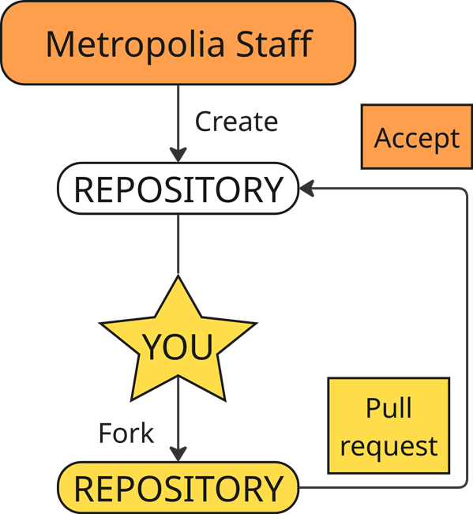

# Metropolia Garage Project Template
## Repository for materials related to Metropolia Garage projects

This is a repository created to serve as a standard template for all official Metropolia Garage projects. 
In this repository, you can find the standard project folder structure, project documentation template and guide as well as introduction to how to use git and github.

**Please take the time to read this MD before you start your project!** 
There are also more topic specific MDs hidden around the folders with more information on how we wish you to structure your project.

### How to proceed
If you don't have Git installed yet, refer to [setting up Git](https://docs.github.com/en/get-started/git-basics/set-up-git).

We highly recommend you to start with the amazing [First Contributions](https://github.com/firstcontributions/first-contributions) guide if you are new to GitHub. 

This template is made with forking and pull requests in mind to systemize workflow and make it easy for Metropolia Staff to access your project later, while allowing you to work as freely as possible.

#### Expected Workflow:

### Project structure

In this project template, you can find a readymade folder structure. Your project may not need some of the folders, in which case its safe to delete them. 
**Otherwise, please use the provided structure.**

#### Overview of the folders

##### Deployment
* Any files or general dependencies that are necessary to get the project running

##### Docs
* Project Report, Notes, Guides, you can find the Word Documentation Template here with basic formatting made

##### Firmware
* Files and software, which are necessary to get your hardware running

##### Hardware
* Schematics, parts and other things related to your project hardware

##### Media
*  All media material related to the project, sorted

##### Presentation
*  Your powerpoint presentations, if you have any

##### References
*  Scientific papers, datasheets, web links - Please name them in a clear manner

##### Software
*  Your actual code, models, libraries etc.

#### Documentation requirements

We expect you to not only properly document your project, but also to write usage instructions. This README is a great way to easily format and visualize usage and instructions for your project on the repository front page. 
If you are new to Markdown, refer to this [cheatsheet](https://github.com/adam-p/markdown-here/wiki/markdown-cheatsheet).

For the actual project documentation, there is a formatted template in the Docs folder you can use if you want, but you don't need to. The important thing is that the format and language of the documentation follows the Metropolia Thesis guidelines. However, we are not strict about it.

### Using Git

#### Getting started

**Fork this repository**: Click the "Fork" button in the top-right corner to create your own copy.
Then set it up locally, using the CMD line:
>git clone [fork-URL]

(Downloads a copy of your fork to your local machine)

>cd [repository-name]          

(Moves into the project directory)

>git remote add upstream [project-repository-URL] 

(Links Git to the original repository (This one))

#### Development Workflow

**Create a feature branch**:

>git checkout -b [new-branch-name]

(Creates and switches to a new branch)

**Make your changes** and commit regularly with clear messages:
>git add . 

(Stages all modified files for commit)

>git commit -m "Implement feature X"

(Records changes with a message)

**Merge to your fork's main branch** when you have a stable checkpoint you want to save

>git checkout main                   

(Switch back to your main branch)

>git merge [new-branch-name]

(Integrate your feature into main)

>git push origin main                

(Push the updated main to your forked repository)

Generally, you want to keep your local main branch as a functional backup and push any feature you are actively working on into its own separate branch. The main branch will be the pull point for the real project repository.

#### Submitting your work to us

**Create a pull request**:
* Go to this repository
* Click "Pull requests" > "New pull request"
* Click "compare across forks"
* Select your fork's main branch as the head repository
* Click "Create pull request"
* Add a title and description explaining your changes

We will accept your changes and they will be copied to this repository. 
